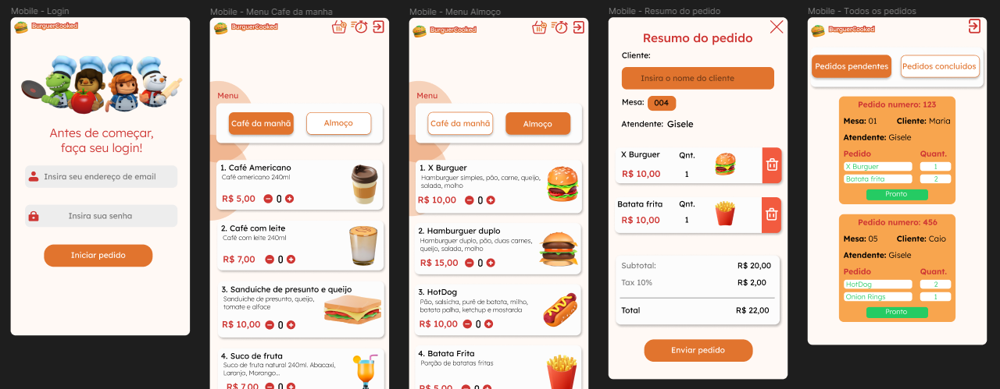

# BurguerCooked
>SAP010 Laboratória

# Índice

* [1. Prefácio](#1-prefácio)
* [2. Resumo do projeto](#2-resumo-do-projeto)
* [3. Histórias de usuário](#3-histórias-de-usuario)
* [4. Tecnologias Utilizadas](#4-tecnologias-utilizadas)

## 1. Prefácio🤩
Uma pequena hamburgueria com a temática do jogo Overcooked que está crescendo e precisa de uma interface 100% responsiva, voltado para realizar pedidos utilizando um tablet e enviá-los para a cozinha para que sejam preparados e após, notificados aos garçons para que sejam entregues aos clientes.

## 2. Resumo do projeto📝
Quinto projeto desenvolvido para o bootcamp da Laboratória. Neste projeto foi desenvolvido um sistema de pedidos para uma hamburgueria, onde esta, possui dois tipos de cardápios (café da manhã e almoço) e o garçom deve ser capaz de anotar o pedido do cliente e envia-lo a cozinha. O cozinheiro deve se autenticar no sistema e ter acesso aos pedidos pendentes e concluídos. O Administrador do sistema deve ter acesso a conseguir cadastrar, editar ou excluir produtos e funcionários da hamburgueria.

## 3. Histórias de usuário📝

<strong>História de usuário 1:</strong>  Garçom/Garçonete deve poder entrar no sistema, caso o admin já lhe tenha dado as credenciais. Eu, como garçom/garçonete quero entrar no sistema de pedidos.

<strong>História de usuário 2:</strong> Garçom/Garçonete deve ser capaz de anotar o pedido do cliente. Eu como garçom/garçonete quero poder anotar o pedido de um cliente para não depender da minha memória, saber quanto cobrar e poder enviar os pedidos para a cozinha para serem preparados em ordem.

<strong>História de usuário 3:</strong> Chefe de cozinha deve ver os pedidos.
Eu como chefe de cozinha quero ver os pedidos dos clientes em ordem, poder marcar que estão prontos e poder notificar os garçons/garçonetes que o pedido está pronto para ser entregue ao cliente.

<strong>História de usuário 4:</strong> Garçom/Garçonete deve ver os pedidos prontos para servir. Eu como garçom/garçonete quero ver os pedidos que estão prontos para entregá-los rapidamente aos clientes.

<strong>História de usuário 5:</strong> Administrador(a) de loja deve administrar seus funcionários. Eu como administrador(a) de loja quero gerenciar os usuários da plataforma para manter atualizado as informações de meus funcionários.

<strong>História de usuário 6:</strong> Administrador(a) de loja deve administrar os produtos. Eu como administrador(a) de loja quero gerenciar os produtos para manter atualizado o menu.

### Desenho de interface do usuário

#### Protótipo de alta fidelidade Mobile

#### Protótipo de alta fidelidade Mobile Administrador

#### Protótipo de alta fidelidade Desktop

## 4. Tecnologias Utilizadas✅ 
    
  

